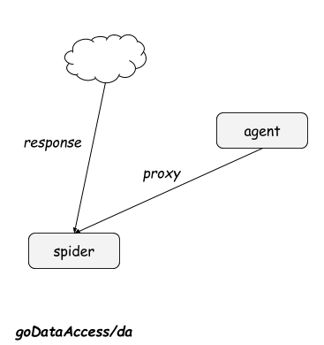
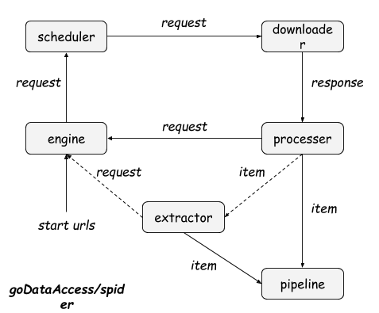
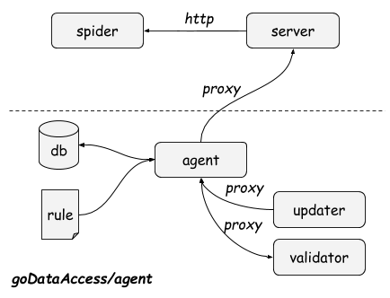

	         ___       _          _                   
	 __ _ ___|   \ __ _| |_ __ _  /_\  __ __ ___ ______
	/ _` / _ \ |) / _` |  _/ _` |/ _ \/ _/ _/ -_|_-<_-<
	\__, \___/___/\__,_|\__\__,_/_/ \_\__\__\___/__/__/
	|___/                                      

goDataAccess is a data access framework implemented in native Golang(1.5+), which is designed to make the DA(data access) process easier and efficient.

[中文文档](https://github.com/zhangxiaoyang/goDataAccess/wiki)

Deploy goDataAccess with Docker: `docker pull zhangxiaoyang/godataaccess`

Introduction
---
For many reasons, we often have to crawl public information from the Internet. The typical way of scraping information includes analyzing target websites and writing rules, writing spiders, saving data, etc, in a process called data access.

To simplify development, you may try Scrapy, one of the most famous web crawling framework written in Python. If the target websites do not have anti-spider strategy, Scrapy may be a good choice. Otherwise, you may need to get more available IP addresses and write your own agents integrated with spiders.

goDataAccess can help you deal with these hassles, which contains three parts: `spider`, `agent` and `da`.

Architecture
---



Spider
---
Spider is a web crawling framework like scrapy, including engine, scheduler, downloader, processer, extractor,  pipeline, and plugin.



#### Example
- Scraping `http://m.baidu.com` with `engine`
```
package main

import (
	"github.com/zhangxiaoyang/goDataAccess/spider/core/engine"
	"github.com/zhangxiaoyang/goDataAccess/spider/core/pipeline"
)

func main() {
	url := "http://m.baidu.com"
	engine.NewEngine("crawl_baidu_and_print_it").AddPipeline(pipeline.NewConsolePipeline()).SetStartUrl(url).Start()
}
```

- Starting spider from JSON file
```
package main

import (
	"github.com/zhangxiaoyang/goDataAccess/spider/core/engine"
)

func main() {
	engine.NewQuickEngine("crawl_baidubaike_with_quickengine.json").Start()
}
```

- Using `extractor`
```
package main

import (
	"bufio"
	"github.com/zhangxiaoyang/goDataAccess/spider/common"
	"github.com/zhangxiaoyang/goDataAccess/spider/core/engine"
	"github.com/zhangxiaoyang/goDataAccess/spider/core/extractor"
	"github.com/zhangxiaoyang/goDataAccess/spider/core/pipeline"
	"os"
	"strings"
)

type MyProcesser struct{}

func NewMyProcesser() *MyProcesser {
	return &MyProcesser{}
}

func (this *MyProcesser) Process(resp *common.Response, y *common.Yield) {
	items := extractor.NewExtractor().
		SetScopeRule(`(?s)<dt class="basicInfo-item name">.*?</dd>`).
		SetRules(map[string]string{
		"key":   `(?s)name">(.*?)</dt>`,
		"value": `(?s)value">(.*?)</dd>`,
	}).
		SetTrimFunc(extractor.TrimHtmlTags).
		Extract(resp.Body)

	for _, item := range items {
		y.AddItem(item)
	}
}

func getUrlsFromFile(fileName string) []string {
	var urls = []string{}
	file, _ := os.Open(fileName)
	r := bufio.NewReader(file)
	for i := 0; i < 10; i++ {
		line, _ := r.ReadString('\n')
		urls = append(urls, strings.TrimSpace(line))
	}
	return urls
}

func main() {
	engine.NewEngine("crawl_baidubaike_with_extractor").
		AddPipeline(pipeline.NewConsolePipeline()).
		SetProcesser(NewMyProcesser()).
		SetStartUrls(getUrlsFromFile("test.url")).
		Start()
}
```

More examples here: <https://github.com/zhangxiaoyang/goDataAccess/tree/master/spider/example>

Learn more plugins: <https://github.com/zhangxiaoyang/goDataAccess/tree/master/spider/plugin>

Agent
---
Agent is based on `goDataAccess/spider`. You can use it to scrape and validate Internet free proxies. Free and available proxies will be served as RPC.



If you want to combine agents with your spiders, you may need to learn [proxy_plugin](https://github.com/zhangxiaoyang/goDataAccess/tree/master/spider/plugin/proxy_plugin.go) or view [DA demos](https://github.com/zhangxiaoyang/goDataAccess/tree/master/da).

#### Usage
```
cd goDataAccess/agent
go run cli.go update # fetching free proxies
go run cli.go validate 'http://m.baidu.com' 'baidu' # picking available proxies which can be used to visit 'http://m.baidu.com'. If response bodies from proxies do not contain 'baidu', proxies will not be picked.
go run cli.go serve # RPC service at 127.0.0.1:1234
```

DA
---
Crawl baike.baidu.com with proxies: <https://github.com/zhangxiaoyang/goDataAccess/tree/master/da/baike.baidu.com>
 
Crawl bgp.he.net(handle cookie/session): <https://github.com/zhangxiaoyang/goDataAccess/tree/master/da/bgp.he.net>
 
License
---
MIT
